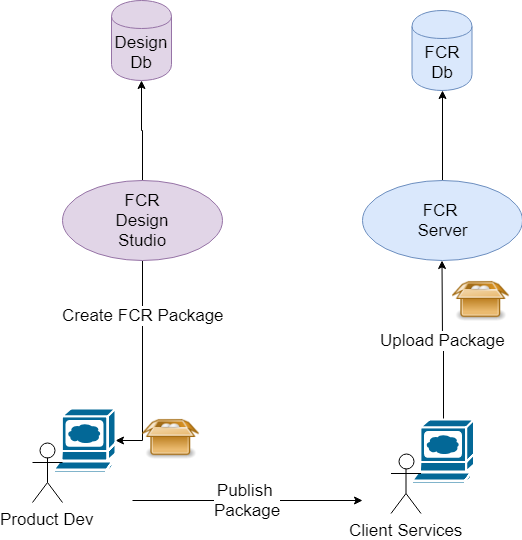
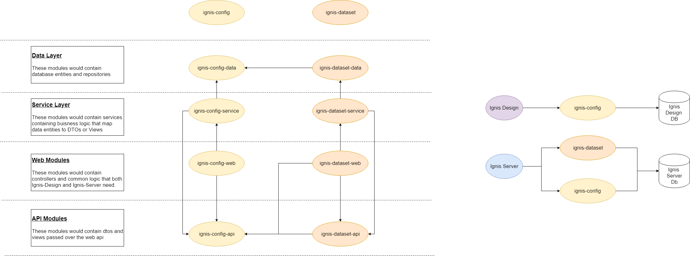

# Ignis Design Studio
A new deliverable to create Ignis Product Configuration

## Status 
In Review

## Context
In order to FCR to be "config driven" it is proposed that we allow the uploading of config in a given "Product Config" 
format [ProductConfig.java](../../ignis-api/src/main/java/com/lombardrisk/ignis/api/productconfig/ProductConfig.java).

This product config would contain a list of [Schemas](../../ignis-api/src/main/java/com/lombardrisk/ignis/api/table/Table.java)
along with their respective rules.

Therefore it will be necessary to give the Product Developers a set of tools to create this config.

## Approach
The following approach will be taken:
- Define a format for the exported product config will take
- Create a new deliverable application to allow for the creation and exporting of product configuration
- Create import functionality for the [IgnisServer](../../ignis-server)

### Defining a format
It is proposed that the format will be a zipped folder. With each Product Config being a file (or folder) within this 
folder. A Product Config would just be a list of versioned schemas

```
- APRA_v1.json
- FED_v1.7.json
- ECR_v9.1.json
```
In this example each json file contains ALL schemas with their repsective rules.


Another option is below
```
- APRA
    - schema1.json
    - schema2.json
- FED
    - fedschema1.json
- ECR
    - eba_schema1.json
    - pra_schema3.json  
```
This example splits each jurisdiction into folders that contain multiple json files for each schema 

This zip would then be used as in the diagram below

### Creating a new deliverable
It is proposed that we create a new application that would share a lot of the same code as the `ignis-server` 
and use the same database structure but would be delivered as a completely separate application with its own database.
This new "Design Studio" would be used to create packages as in the diagram below.



### Creating Import Functionality
It is proposed that we provide functionality in the `ignis-server` to allow the uploading of the zip described above.
This would consist of:
- A new REST API
- New components in `ignis-ui` to all the user 
    - To upload new packages
    - To view existing packages
     

## Decision
TBC

## Consequences
The following issues will need to be discussed

### Module Structure
As the two deliverables, `ignis-server` and `ignis-design` will be able to benefit from shared code.
In order to share this code we will need to think about how to structure the modules.

It is proposed that we create a "domain based" module structure. This means that we would have top level modules for
the different domain concepts. A simple example is given below
```
- app-user
- app-policy
- app-vehicle
``` 

It is propsed that we create two "domain" modules
- `ignis-config`
- `ignis-dataset`

In this way the `ignis-design` deliverable will only need to concern itself with the `ignis-config` module as that is
the purposed of the design deliverable, to create config. And the ignis server would concern itself with both 
`ignis-config` and `ignis-dataset`

The following diagram outlines the proposal

