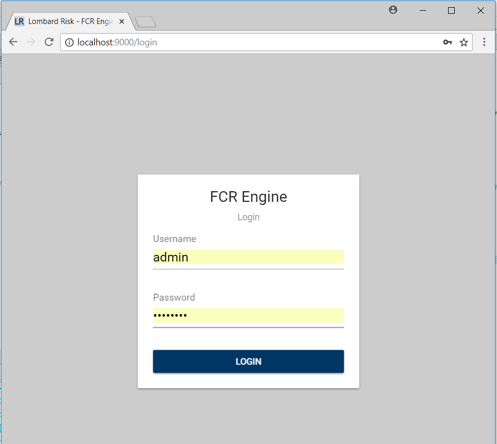
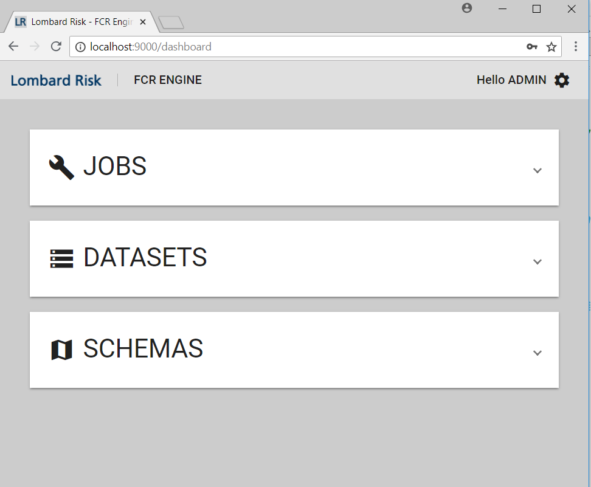

# Developer Guide
The following document is to be used to get up and running with developing for `ignis-ui`.

## Running the build
Run the following steps before starting the angular app
- Install node dependencies `npm install` (the command `mvn clean install` will also do this)
- Build `dist` folder with `npm run build`

Once the app is built we can start the app with
`npm run start`

### Environment Variables
In order to point your angular app at the correct api you will need to change [`environment.ts`](../src/environments/environment.ts). 
This file contains the root paths to the api server
```
export const host = 'https://<localhost_or_your_host_nam>:8443/fcrengine';

export const environment = {
  production: false,
  api: {
    root: `${host}/api`
  },
  url: {
    login: `/login`
  }
};
```

### Custom Chrome Application
In order to point your angular application at the FCR api server we need create a custom version of chrome that will 
ignore issues like
- CORS
- Lack of HTTPS certificates

Create a shortcut with the following path and variables
```
C:\Users\MatthewSibson\AppData\Local\Google\Chrome SxS\Application\chrome.exe" --disable-web-security --user-data-dir="C:/ChromeDevSession
```

### Viewing in Chrome
Once running the node server will be listening on port 9000. Going to the following url will open the app `http://localhost:9000`. 
You should be redirected to login.




#### Before you log in
Before logging in you need to go to the FCR Api server and tell Chrome continue eventhough no certificate is present.
Otherwise you will not be able to make requests from the app.



### Common issues
The issues can often occur and can eaisily be mitigated.

##### Node Sass
Often the build will fail due some issues with `node-sass` to fix these issues the following command is recommended
```
npm rebuild node-sass
```
